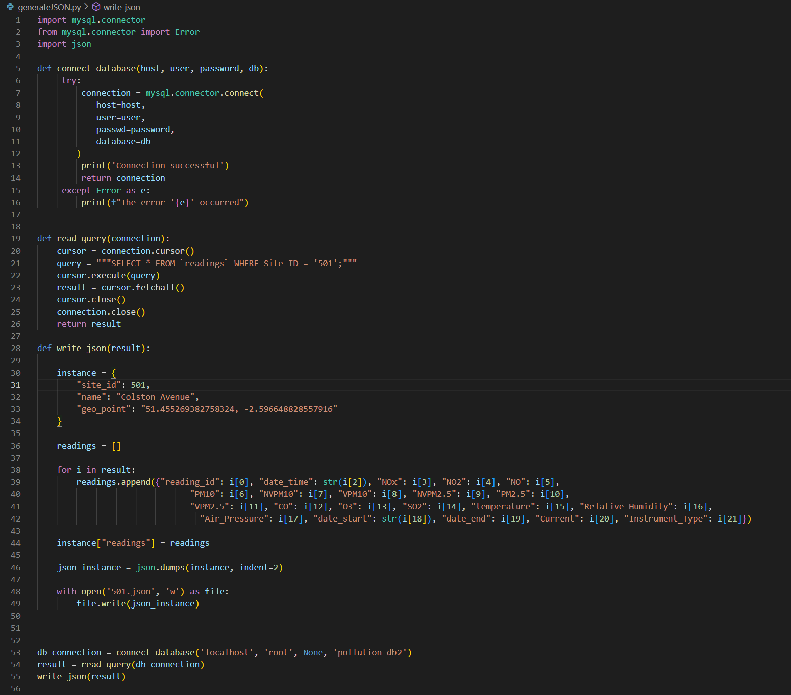
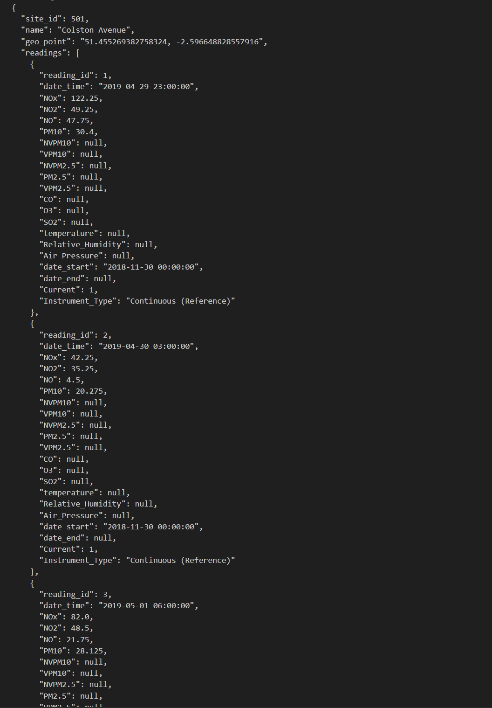
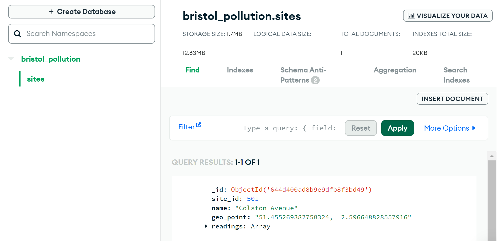
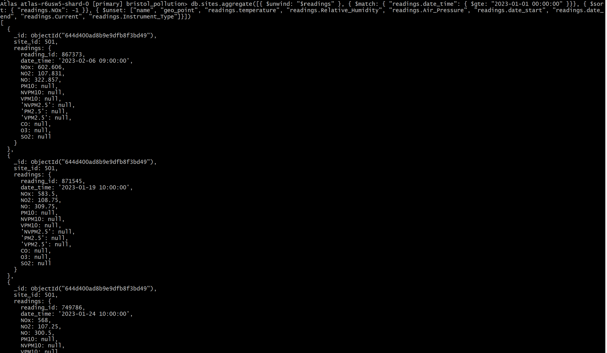

# Modelling data to a NoSQL database 

#### Site chosen: 501, Colston Avenue. 
#### I chose a key-value approach to model the data for this site and stored it as a JSON document. 

To create the JSON document, I took the data from the relational pollution-db2. 

Figure 1 shows the Python scrip that creates the JSON document.

* First created a function to connect to the database.
* Passed this connection to a function that executed a SQL query which selects all instances where the site id is 501. 
* Passed this result to a function to write a JSON file.
* Defined the keys _site_id_, _name_ and _geo_point_. 
* Created a list containing each reading for the site 501 from the result of the SQL query.
* Added the key _readings_ to the dictionary with the list of readings as the value.
* Converted the dictionary to a JSON object then wrote this to a JSON file. 

Figure 2 shows a snippet of the JSON file created by this process.

**Figure 1** Python script to create JSON document for site 501.

**Figure 2** Snippet of the JSON file created.

I chose to model this data using a denormalized model with embedded documents due to the one-to-many relationship of one site to many readings. I created one document containing the data for the site which included the site id, site name and its geo location. Inside this I embedded the document for the readings. The key readings contained an array of each reading for the site as its value. This document was placed inside one collection called sites within the database. I chose this way rather than having a document for each reading and embedding the site data into each of these as this would cause much repetition of the site data. 
Another approach to modelling the data would have been to create separate documents for the site and the readings, store these in separate collections and have references between the sites and readings. This data would then be normalised like in a relational model. I chose to use the denormalized model with embedded documents over the normalised model due to faster querying. As only one collection needs to be queried, results are returned faster. Also, with the normalised model, the documents for each site would contain large, potentially growing arrays of reading ids. 

I imported the JSON file to a MongoDB database using mongoimport and created the collection _site_ to store the document in, see Figure 3.

**Figure 3** sites collection in bristol_pollution database on MongoDB.

 

To query my database, I downloaded MongoDB shell and then created a connection via this to the database.  

**See below the MongoDB query**

`db.sites.aggregate([{ $unwind: "$readings" }, { $match: { "readings.date_time": { $gte: "2023-01-01 00:00:00" }}}, { $sort: { "readings.NOx": -1 }}, { $unset: ["name", "geo_point", "readings.temperature", "readings.Relative_Humidity", "readings.Air_Pressure", "readings.date_start", "readings.date_end", "readings.Current", "readings.Instrument_Type"]}])`

I queried my database (bristol_pollution) to return the readings for the year 2023 sorted by the concentration of oxides of nitrogen (NOx) from highest to lowest. I first defined the collection to query: _db.sites_. I then used MongoDBs aggregation pipeline. I used the $unwind operator to 'unwind' the readings array of embedded readings documents, this created individual documents for each reading. I then passed these to the $match operator to find the readings that were in the year 2023 by using the greater than or equal to operator ($gte).  As there is only one document in my collection, I didn’t need to add a match statement before the unwind to match documents that contained readings after 2023-01-01 00:00:00. If there were multiple documents in the sites collection containing readings from lots of different dates, I would have needed to add this to prevent every _readings_ array from being unwound. I then use the $sort operator to sort the documents by the NOx level in descending order (represented by -1). I included the $unset operator with an array of fields to remove. I did this to clean up the output. See figure 4 for the query and the first few documents the output produced. 

**Figure 4** Snapshot of mongoDB query and first couple of documents returned. 

